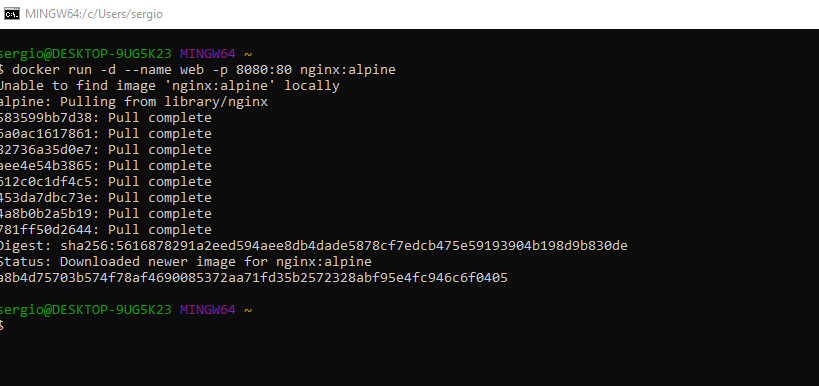
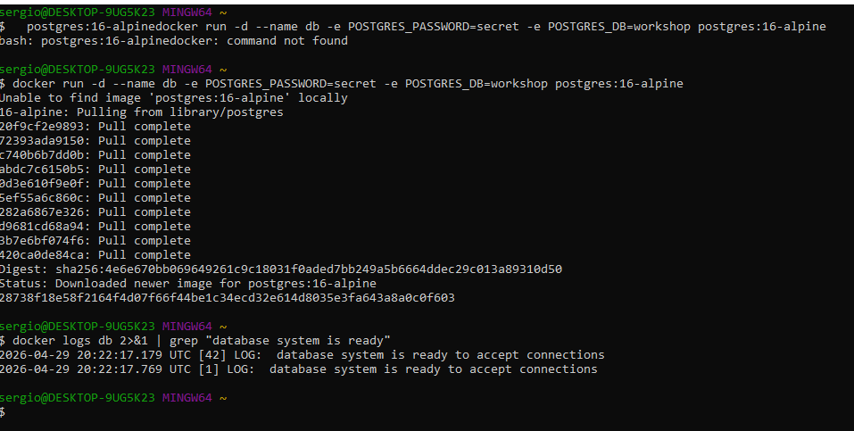

# Docker CLI Puro: Exploração Guiada

> **Metodologia:** Comando → Executa → Pergunta → Resposta. Pause a cada bloco.
> 
> 
> **Objetivo:** Internalizar o modelo mental de rede, isolamento e ciclo de vida antes de abstrair com YAML.
> 

💡 **Nota para Windows:**

O `curl` nativo do CMD/PowerShell pode ter comportamento inconsistente com flags como `-sI`.

✅ **Recomendação:** Use **WSL2** ou **Git Bash** para os comandos de terminal deste bloco.

Se precisar usar PowerShell, substitua `curl -sI` por `Invoke-WebRequest -Uri http://localhost:8080 -Method Head`.



---

### 🔍 1. Portas (`p`): Mapeamento Host ↔ Container

**O que o `-p` realmente faz?**

A flag `-p HOST:CONTAINER` cria uma regra no **iptables/NAT do Docker Engine** que redireciona tráfego da interface de rede do host para a interface interna do container. O container continua ouvindo na porta original; o Docker faz o "tradutor" de portas.

```bash
# 1. Sobe um Nginx mapeando porta 8080 (host) → 80 (container)
docker run -d --name web -p 8080:80 nginx:alpine

# 2. Testa a conexão
curl -sI http://localhost:8080 | head -n 1
# → HTTP/1.1 200 OK
```

🔍 **O que está acontecendo:**

- O Nginx dentro do container está ouvindo em `0.0.0.0:80` (padrão da imagem).
- O Docker Engine intercepta conexões em `localhost:8080` no host e as encaminha para `172.17.0.2:80` (IP interno do container).
- O container **não sabe** que está sendo acessado via porta 8080. Para ele, é uma requisição normal na porta 80.

🧪 **Experimentos Guiados:**

1. **Inspecione o mapeamento ativo:**
    
    ```bash
    docker port web
    # → 80/tcp -> 0.0.0.0:8080
    # → 80/tcp -> [::]:8080  (IPv6, se habilitado)
    ```
    
    Isso mostra a regra de NAT criada pelo Docker. Útil para debugar "por que não consigo acessar?".
    
2. **Reproduza o erro de porta ocupada (de forma controlada):**
    
    ```bash
    # Tente subir outro container mapeando a MESMA porta do host
    docker run -d --name web2 -p 8080:80 nginx:alpine
    # → docker: Error response from daemon: Ports are not available: exposing port TCP 0.0.0.0:8080 -> 0.0.0.0:0: listen tcp 0.0.0.0:8080: bind: address already in use.
    ```
    
    🔍 **Por que acontece:** O Docker tenta fazer `bind()` na porta 8080 do host, mas o processo do primeiro container (`web`) já está ocupando esse socket. O kernel do host rejeita.
    
3. **Libere a porta e valide:**
    
    ```bash
    docker stop web
    docker port web  # → (sem output, container parado)
    docker run -d --name web2 -p 8080:80 nginx:alpine  # ✅ Agora funciona
    ```
    
4. **Mapeamento seletivo (localhost apenas):**
    
    ```bash
    docker run -d --name internal -p 127.0.0.1:9090:80 nginx:alpine
    curl -sI http://localhost:9090 | head -n 1  # ✅ Funciona
    # Tente acessar de outra máquina na rede: http://SEU_IP:9090 → ❌ Timeout
    ```
    
    🔍 **Use case:** Serviços que você quer acessar apenas localmente (ex: admin panels, debug endpoints).
    

---

### 🔍 2. Variáveis de Ambiente (`e`): Injeção ≠ Configuração

**O que o `-e` realmente faz?**

Ele injeta pares `CHAVE=VALOR` no ambiente do processo principal (`PID 1`) do container. **Atenção crucial:** o Docker *não configura seu aplicativo automaticamente*. Quem decide ler e usar essas variáveis é o código, o framework ou o script de entrada (`entrypoint.sh`) da imagem.

### ✅ Exemplo 1: PostgreSQL (funciona "de fábrica")

A imagem oficial do Postgres possui um entrypoint (`docker-entrypoint.sh`) que lê variáveis como `POSTGRES_PASSWORD`, `POSTGRES_DB` e `POSTGRES_USER`, e executa scripts de inicialização para criar banco, usuário e configurar autenticação.

```bash
docker run -d --name db -e POSTGRES_PASSWORD=secret -e POSTGRES_DB=workshop postgres:16-alpine

# Verifique se o banco inicializou
docker logs db 2>&1 | grep "database system is ready"
# → ... database system is ready to accept connections
```



### ❌ Exemplo 2: Redis (a armadilha comum)

Muitos materiais ensinam `-e REDIS_PASSWORD=123`. **Isso não funciona.** O processo `redis-server` ignora essa variável. Ele só aceita autenticação via argumento de linha de comando (`--requirepass`) ou via arquivo `redis.conf`.

```bash
# 1. Injeta a variável (o Redis ignora)
docker run -d --name cache -e REDIS_PASSWORD=123 redis:alpine

# 2. Tenta conectar passando a senha
docker exec -it cache redis-cli -a 123 ping
# 📝 Output:
# Warning: Using a password with '-a' or '-u' option on the command line interface may not be safe.
# AUTH failed: ERR AUTH <password> called without any password configured for the default user. Are you sure your configuration is correct?
# PONG
```

🔍 **O que aconteceu?**

- O `Warning` é padrão do `redis-cli` (senhas na CLI ficam visíveis no histórico e em `docker ps`).
- O `AUTH failed` acontece porque o Redis **não estava configurado com senha**. A variável `REDIS_PASSWORD` foi injetada no ambiente, mas o processo `redis-server` não foi programado para lê-la.
- O `PONG` aparece porque o Redis **sempre responde ao `PING`**, independente de autenticação. O comando `PING` não exige auth; só comandos como `GET`, `SET`, `CONFIG` exigem.

🧪 **Prove que a variável está lá (mas é ignorada):**

```bash
docker exec cache env | grep REDIS
# → REDIS_PASSWORD=123  (A variável ESTÁ lá! Mas o processo não foi programado para lê-la)
```

### 💡 Como resolver corretamente?

Passe a configuração diretamente para o binário do processo, sobrescrevendo o `CMD` padrão da imagem:

```bash
docker rm -f cache  # limpa o container anterior
docker run -d --name cache redis:alpine redis-server --requirepass 123
docker exec -it cache redis-cli -a 123 ping
# → PONG (autenticação funcionando sem erros)
docker exec -it cache redis-cli -a 145 ping
Warning: Using a password with '-a' or '-u' option on the command line interface may not be safe.
AUTH failed: WRONGPASS invalid username-password pair or user is disabled.
(error) NOAUTH Authentication required.
```

🧪 **Experimentos Guiados:**

1. **Rode sem `-e` e conecte:**
    
    ```bash
    docker run -d --name cache2 redis:alpine
    docker exec -it cache2 redis-cli ping
    # → PONG (funciona livremente, pois nenhuma senha foi exigida)
    ```
    
2. **Conceito-chave para levar:** Variáveis de ambiente são *dados injetados no SO do container*. A imagem precisa ter lógica explícita para interpretá-las. Em produção, nunca hardcode senhas. Use `.env` (para dev), `Docker Secrets` ou gerenciadores como HashiCorp Vault/AWS Secrets Manager.

---

### 🔍 3. Redes & DNS Interno (`-network`): Service Discovery Manual

**Como os containers se comunicam entre si?**

Por padrão, o Docker cria uma rede virtual chamada `bridge` (subnet `172.17.0.0/16`). Containers nela conseguem acessar a internet e se comunicar via IP, mas **não resolvem nomes automaticamente** (ex: `ping meu-container` falha). Para descoberta automática de serviços, você precisa criar uma **rede customizada**.

### ❌ Exemplo 1: Rede padrão (`bridge`)

```bash
# Sobe dois containers na rede padrão do Docker
docker run -d --name svc-a nginx:alpine
docker run -d --name svc-b nginx:alpine

# Tenta pingar pelo nome (vai falhar)
docker exec svc-a ping -c 2 svc-b
# → ping: bad address 'svc-b'
```

🔍 **Por que?** A rede `bridge` padrão desabilita o DNS interno do Docker por questões de compatibilidade histórica e isolamento. Containers só se enxergam via IP (`172.17.0.x`), que é dinâmico e não confiável para configuração.

### ✅ Exemplo 2: Rede customizada (com DNS automático)

```bash
# 1. Cria uma rede isolada com driver bridge (padrão)
docker network create app-net

# 2. Sobe containers anexando à nova rede
docker run -d --name api --network app-net nginx:alpine
docker run -d --name worker --network app-net alpine sleep 3600

# 3. Testa comunicação por nome
docker exec worker ping -c 2 api
# → PING api (172.18.0.2): 56 data bytes
# → 64 bytes from 172.18.0.2: icmp_seq=0 ttl=64 time=0.087 ms
# ✅ Funciona! O Docker resolveu "api" para o IP interno automaticamente.
```

🔍 **O que está acontecendo por baixo dos panos?**

- O Docker roda um servidor DNS embutido em `127.0.0.11` dentro de cada container.
- Quando você cria uma rede customizada, esse DNS registra automaticamente os nomes dos containers conectados a ela.
- Isso é a base do **service discovery** em microsserviços: você configura `DB_HOST=db` e o DNS interno resolve para o IP atual do container `db`, mesmo que ele seja recriado com IP diferente.

🧪 **Experimentos Guiados:**

1. **Descubra os IPs internos e a topologia:**
    
    ```bash
    docker network inspect app-net --format='{{json .Containers}}' | python3 -m json.tool
    # Veja os IPs 172.18.0.x atribuídos dinamicamente + nomes dos containers
    ```
    
2. **Verifique o DNS dentro do container:**
    
    ```bash
    docker exec worker cat /etc/resolv.conf
    # → nameserver 127.0.0.11
    # → options ndots:0
    ```
    
    O `127.0.0.11` é o DNS embutido do Docker. `ndots:0` significa que nomes sem ponto (ex: `api`) são consultados diretamente, sem sufixos de domínio.
    
3. **Teste o isolamento de rede:**
    
    Suba um terceiro container **sem** `--network app-net` e tente pingar `api`. Vai falhar.
    
    ```bash
    docker run -it --rm alpine ping -c 2 api
    # → ping: bad address 'api'  (container na rede 'bridge' padrão não enxerga 'app-net')
    ```
    
    🔍 **Conceito:** Redes Docker são firewalls lógicos por padrão. Só quem está na mesma rede conversa. Isso é segurança por design.
    
4. **Ponte para o Docker Compose:**
    
    O Compose cria automaticamente uma rede customizada com o nome do seu projeto (`projeto_default`). É exatamente por isso que `DB_HOST=db` funciona sem você digitar `docker network create`. Ele só aproveita o DNS interno que acabamos de testar na prática.
    

---

### 🔍 4. Debug & Inspeção: O Kit de Sobrevivência

**Regra de Ouro:** `logs` primeiro → `ps` depois → `exec` por último. Nunca tente adivinhar; deixe o container te dizer o que está errado.

⚠️ **Antes de continuar:** o container `web` foi parado lá na seção 1 (passo 3) e nunca voltou a rodar. Religue-o para os exemplos abaixo funcionarem como documentado:

```bash
docker start web
docker ps | grep web  # → confirme STATUS "Up"
```

```bash
# 1. Logs: primeira linha de defesa
docker logs web
# → Mostra stdout/stderr do processo principal. Use -f para seguir em tempo real.

# 2. Estado dos containers
docker ps          # só rodando
docker ps -a       # todos (inclui parados/exited)
docker stats       # CPU/MEM/NET em tempo real (igual ao 'top')

# 3. Inspeção profunda (JSON completo)
docker inspect web | grep IPAddress
# → "IPAddress": "172.17.0.2"
docker inspect web --format='{{.NetworkSettings.Ports}}'
# → map[80/tcp:[{0.0.0.0 8080}]]  (mapeamento de portas)

# 4. Terminal cirúrgico dentro do container
docker exec -it web sh
# → Você está DENTRO do container. Teste manualmente:
#    curl localhost, cat /etc/hosts, ping api, etc.
# → Digite 'exit' para sair.

# 5. Ciclo de vida limpo
docker stop web && docker rm web
# → Para graciosamente (SIGTERM) e remove. Use -f para forçar se travar.
```

🧪 **Experimentos Guiados:**

1. **Simule um erro e capture o log:**
    
    ```bash
    docker run -d --name bad nginx:alpine nginx -g "daemon off;" -c /nao/existe.conf
    docker logs bad
    # → nginx: [emerg] open() "/nao/existe.conf" failed (2: No such file or directory)
    ```
    
    🔍 **Lição:** O log mostra o erro exato que o processo principal (`PID 1`) reportou. Sempre comece aqui.
    
2. **Compare `inspect` vs `docker port`:**
    
    ```bash
    docker port web
    # → 80/tcp -> 0.0.0.0:8080
    
    docker inspect web --format='{{json .NetworkSettings.Ports}}'
    # → {"80/tcp":[{"HostIp":"0.0.0.0","HostPort":"8080"}]}
    ```
    
    🔍 **Quando usar cada um:** `docker port` é rápido e legível. `inspect` é completo e scriptável (útil para automação).
    
3. **Entre no container e teste a rede interna:**
    
    ```bash
    docker exec -it worker sh
    # Dentro do container:
    ping api          # ✅ Resolve via DNS interno
    curl http://api   # ✅ Acessa o Nginx do outro container
    exit
    ```
    
4. **Limpeza segura:**
    
    ```bash
    docker system df            # Espaço usado por Docker
    docker system prune -f      # Remove containers/imagens/networks órfãos (seguro)
    # ⚠️ Nunca use 'prune -a' em produção: remove TUDO não usado, incluindo imagens em uso.
    ```
    

📌 **Fluxo de Debug Recomendado (sempre nesta ordem):**

1. `docker compose logs -f <serviço>` → O que o processo está reclamando?
2. `docker compose ps` → Container está `Up` ou `Exited (1)`?
3. `docker compose exec <serviço> sh` → Teste manualmente dentro do container.
4. `docker compose config` → YAML está sendo interpretado corretamente?
5. `docker system prune -f` → Espaço cheio travando o daemon?

---

### 🎯 Transição Natural para o Próximo Bloco

> *"Agora que vimos como é verboso configurar portas (`-p`), variáveis (`-e`), redes (`--network`) e volumes (`-v`) manualmente... imagine fazer isso para 5 serviços com dependências entre si. É exatamente aqui que o Docker Compose entra: ele transforma essa CLI repetitiva em um YAML declarativo, reproduzível e versionável."*

---

### 🧹 Limpeza Antes de Continuar

Este bloco criou vários containers e uma rede (`web`, `web2`, `internal`, `db`, `cache`, `cache2`, `svc-a`, `svc-b`, `api`, `worker`, `bad`, `app-net`). Antes de seguir para o próximo capítulo, limpe tudo para começar do zero e evitar conflitos de porta ou nome:

```bash
docker rm -f $(docker ps -aq)
docker network rm app-net
```
>